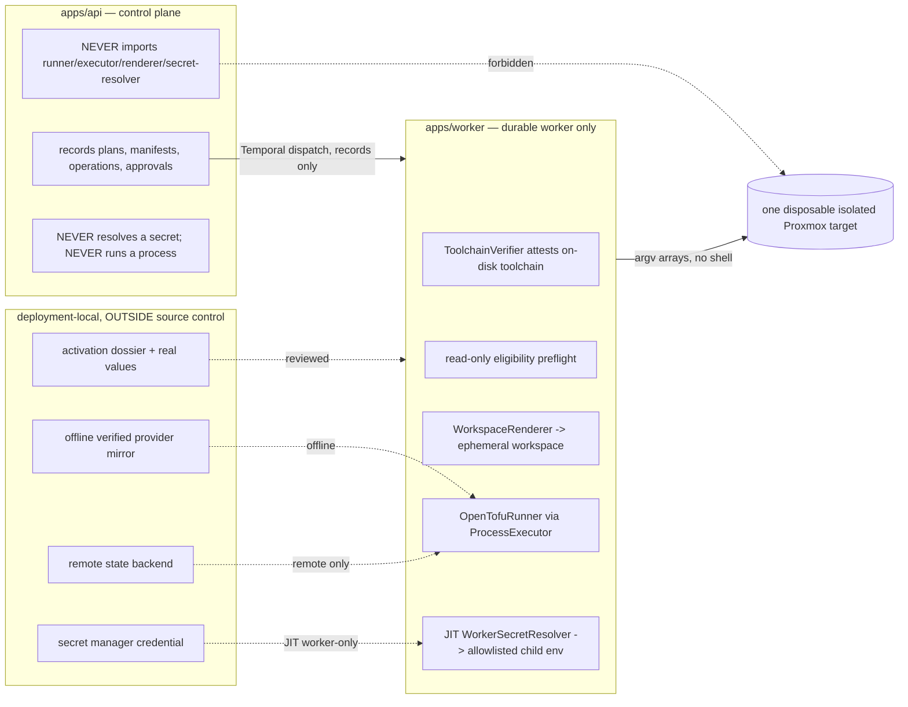

# SECP-002B-1B — First real disposable-lab lifecycle (architecture)

**Status of this document:** concrete architecture for the future B1-B milestone, locked by
[ADR-020](../adr/ADR-020-first-real-disposable-lab-lifecycle.md). It is **design-only** and
**activates nothing**. No real OpenTofu process, plan, apply, or destroy has run; no real Proxmox host
has been contacted. Both B1-A subprocess seals remain `True`.

Related: ADR-011/012/013/014; `docs/architecture/secp-002b-0-provisioning-safety.md`;
`docs/architecture/secp-002b-1a-opentofu-lab-contract.md`;
`docs/architecture/secp-002b-1b-target-onboarding.md`;
`docs/implementation/secp-002b-1b-plan.md`; `docs/proxmox/b1b-lab-prerequisite-checklist.md`;
`docs/runbooks/b1b-first-real-lab.md`.

## 1. Maturity legend (what each component IS today)

Every component below is tagged with exactly one maturity level. This document must never blur these.

- **architecture-locked** — designed and locked here; no code yet.
- **code-implemented-with-fakes** — real seam exists, exercised only via `Fake*` (no real I/O).
- **contract-complete-but-sealed** — full contract built + tested, shipped disabled/denying.
- **controlled-live-read-only** — real read-only worker path, sealed by default, never mutates.
- **future-real-mutation** — not built; requires a reviewed unseal.
- **evidence-from-a-real-run** — durable evidence from one completed human-reviewed B1-B run
  (**none exists today**).

## 2. Current state inherited from B0 / B1-A / onboarding / discovery

| Inherited capability | Component (actual names) | Maturity |
| --- | --- | --- |
| Immutable manifest bound to an approved plan + target | `ProvisioningManifest` (`apps/api/secp_api/models.py`) | code-implemented-with-fakes |
| Durable idempotent operation lifecycle | `ProvisioningOperation` (`idempotency_key = sha256(manifest_content_hash + ":" + kind)`) | code-implemented-with-fakes |
| Exact change-set approval | `ProvisioningChangeSetApproval` + `services/approvals.py` | code-implemented-with-fakes |
| Immutable pinned toolchain provenance | `ToolchainProfile` + `secp_api/toolchain_profile.py` (`validate_toolchain_profile`) | code-implemented-with-fakes |
| Strict blast-radius scope policy | `secp_api/provisioning_scope.py` (`validate_provisioning_scope`) | code-implemented-with-fakes |
| Approved, active onboarding + boundary | `TargetOnboarding` (ADR-014) | code-implemented-with-fakes |
| Worker-only runner behind sealed executor | `OpenTofuRunner`, `ProcessExecutor`, `SubprocessProcessExecutor` (**SEALED**), `FakeProcessExecutor` | contract-complete-but-sealed |
| Transient exact prepared plan | `PreparedOpenTofuPlan`, `apply_prepared`, `destroy_prepared` (`provisioning/opentofu.py`) | code-implemented-with-fakes |
| Canonical redacted change set | `plan_json.canonicalize_plan_json` + `change_set_hash` | code-implemented-with-fakes |
| Toolchain verifier seam | `ToolchainVerifier` protocol; `FakeToolchainVerifier`; `RealToolchainVerifier` (inert) | code-implemented-with-fakes |
| Isolated-lab activation gate | `RealLabActivationGrant`, `build_process_executor`, `run_real_provisioning`, `_assert_real_gate` | contract-complete-but-sealed |
| Worker secret resolution (final) | `WorkerSecretResolver`, `SealedSecretResolver` (→ `credential_unavailable`) | contract-complete-but-sealed |
| Worker identity / admission | `WorkerIdentityRegistration`, `WorkerDiscoveryAdmission` (Ed25519 signed-nonce PoP) | contract-complete-but-sealed |
| Resolver activation / resolution lease | `ResolverActivationAuthorization`, `SealedActivationGate`, `ResolutionLease` | contract-complete-but-sealed |
| Worker-owned SSH read-only discovery | `services/target_discovery.py`, `onboarding/live_readonly.py` | controlled-live-read-only |
| Real toolchain attestation (on-disk) | — | future-real-mutation |
| Real eligibility preflight (Proxmox read-only) | — | future-real-mutation |
| Remote-state / JIT-secret readiness | — | future-real-mutation |
| Real `init`/`plan`/`show` | — | future-real-mutation |
| Real apply / verify / destroy / zero-residue | — | future-real-mutation |
| A completed real lifecycle run | — | evidence-from-a-real-run (**none**) |

## 3. Component and trust boundaries



**Trust boundaries.** (1) API ↔ worker: the API records intent + approvals and dispatches via
Temporal; it **never** executes a runner, resolves a secret, or runs a process (enforced by
`tests/test_architecture_boundary.py` + `tests/test_provisioning_boundary.py`). (2) worker ↔
deployment-local: real values, credentials, mirror, and state live outside source control and reach
the worker only through the reviewed dossier + secret manager. (3) worker ↔ lab: only the worker
contacts the disposable target, over argv arrays (never a shell), with an allowlisted child env.

## 4. Durable vs transient state

| Data | Durable (SECP DB, redacted, secret-free) | Transient (worker-local, never persisted) |
| --- | --- | --- |
| Approved plan / manifest / toolchain / onboarding ids + hashes | ✔ | |
| Redacted canonical change set + `change_set_hash` | ✔ (`ProvisioningOperation.result`) | |
| `ProvisioningChangeSetApproval` (exact hash, actor) | ✔ | |
| Preflight / attestation / verification / residue evidence (redacted, hashed, expiry-bound) | ✔ | |
| Activation-dossier **hash** + bound ids | ✔ | |
| Raw dossier, real values, credential | | external operator evidence (secret manager) |
| Rendered workspace (`RenderedWorkspace`) | | ✔ (ephemeral 0o700/0o600, always cleaned) |
| Raw binary plan / `PreparedOpenTofuPlan` | | ✔ (transient, cleaned in `finally`, never serialized) |
| Resolved secret / `TF_VAR_*` values | | ✔ (allowlisted child env only, redacted) |
| Raw `tofu show -json`, provider bodies, state contents | | ✔ (dropped by `canonicalize_plan_json`; never stored/logged) |

**Prepared-plan survival across restart:** the transient `PreparedOpenTofuPlan` **deliberately does
not survive** a worker restart between approval and apply. Only the human approval is durable. On the
apply attempt the worker **re-prepares** a fresh plan in one attempt and requires the fresh canonical
`change_set_hash` to **exactly match** the durable approval before applying that same fresh plan
(ADR-020 §I; ADR-013 amendment).

## 5. Gate matrix (apply/destroy; every row must hold)

| Gate condition | Source of truth | On failure |
| --- | --- | --- |
| Non-production environment | `Settings.app_env != production` | refuse |
| Temporal/durable dispatch (inline refused) | `_assert_real_gate` / `dispatch.py` | refuse |
| Operation-specific enablement + **code seal** unsealed | per-capability seal constant (C) | refuse (technically incapable) |
| Approved target-bound `DeploymentPlan` | plan status + target binding | refuse |
| Immutable `ProvisioningManifest` (no drift) | `content_hash` re-compare | refuse |
| Approved & active `TargetOnboarding`, no boundary drift | `effective_boundary_hash` | refuse |
| Fresh passing eligibility preflight (E) | worker read-only evidence | refuse |
| Verified toolchain attestation (F) | `RealToolchainVerifier` | refuse |
| Remote-state present + lock held (G) | backend + lock | refuse |
| Target config / scope / reservations hash agreement | `config_hash` / `provisioning_scope_policy_hash` / `reservations_hash` | refuse |
| Toolchain profile hash agreement + `isolated_lab` | `toolchain_profile_hash`, `activation_class` | refuse |
| Exact human-approved change-set hash matches fresh dry run | `change_set_hash` == approval | refuse (new approval) |
| Exact prepared plan applied (no re-plan) | `apply_prepared`/`destroy_prepared` | refuse |
| `RealLabActivationGrant` minted only post-gate | `grant_real_lab_activation(gate_passed=True)` | refuse |
| No fake runner/executor in a real-lab request | real verifier requirement | refuse |
| External connectivity policy `deny` | scope policy | refuse |
| Same organization across all bindings | `organization_id` equality | refuse |

## 6. Failure-state matrix

| Failure | Detected by | Closed outcome | Auto-retry? | Recovery |
| --- | --- | --- | --- | --- |
| Interrupted / partial plan | nonzero init/plan/show or malformed json | operation `failed` | no | fresh dry run |
| Interrupted / partial apply | worker crash, provider timeout | `recovery_required` | **no blind re-apply** | operator + fresh approval |
| Verification mismatch | observed vs approved compare | `verification_failed` | no | operator |
| Isolation breach | no-route / boundary check | `isolation_failed` | no | operator containment |
| State ↔ provider disagreement | preflight/verify/destroy compare | `state_disagreement` → `recovery_required` | no | operator reconcile |
| State-lock loss | lock re-check | `recovery_required` | no | operator |
| Destroy failure / interruption | destroy nonzero / crash | `failed` (idempotent retry-safe) | re-verify only | recovery owner |
| Zero-residue mismatch | independent provider+state re-scan | `zero_residue_failed` | no | manual cleanup |
| Credential revocation | resolver `credential_unavailable` | fail closed | no | operator |
| Toolchain drift | verifier attestation | fail closed | no | worker owner |

## 7. Approval-invalidation matrix

An approval (`ProvisioningChangeSetApproval` for an exact `change_set_hash`) is **invalidated** — a
fresh dry run + fresh approval is required — by any of:

| Change | Hash that moves |
| --- | --- |
| Target config edit | `config_hash` |
| Scope-policy edit | `provisioning_scope_policy_hash` |
| Reservation change | `reservations_hash` |
| Manifest regeneration | manifest `content_hash` |
| Toolchain profile change | `toolchain_profile_hash` |
| Renderer/bundle/lockfile/mirror change | renderer version / bundle / lockfile / mirror ids |
| Onboarding boundary change | `effective_boundary_hash` |
| Observed provider/state drift since approval | fresh canonical `change_set_hash` |
| Approval already consumed | `mark_consumed` status |

Apply and destroy approvals are **independent**: a destroy never reuses an apply approval.

## 8. Operation-specific unseal model

Each capability (plan, apply, destroy) has its **own** code seal constant, its **own** runtime
enablement, and its **own** human approval. Unsealing one leaves the others sealed as `True` code
constants, so a plan-only build **cannot** apply or destroy (ADR-020 §C). Advancing is a reviewed
source change plus the full runtime gate — **never** a configuration flag.

## 9. Sequence — plan → approve → apply → verify → destroy → zero-residue

```mermaid
sequenceDiagram
  participant Op as Operator/Approver
  participant API as apps/api (records only)
  participant WF as Temporal workflow
  participant WK as apps/worker
  participant Lab as Disposable Proxmox
  Note over WK,Lab: every step is a SEPARATE explicit action; nothing auto-chains
  Op->>API: request eligibility preflight
  API->>WF: dispatch (Temporal)
  WF->>WK: run read-only preflight
  WK->>Lab: read-only inspection
  WK-->>API: immutable redacted evidence (pass/refuse)
  Op->>API: request real plan (plan-only phase)
  WF->>WK: attest toolchain, render once, offline init, one plan, show -json
  WK->>WK: canonicalize+redact -> change_set_hash
  WK-->>API: redacted change set + hash (persist metadata only)
  Op->>API: APPROVE exact change_set_hash (decision, not execution)
  Op->>API: request apply
  WF->>WK: re-prepare fresh plan; require fresh hash == approval; apply_prepared (same plan)
  WK->>Lab: apply exact prepared plan
  WK-->>API: apply result (no auto success)
  WF->>WK: post-apply verification (observed vs approved, isolation, no-route)
  WK-->>API: verified | verification_failed | state_disagreement | isolation_failed | recovery_required
  Op->>API: request destroy plan (separate)
  WF->>WK: generate destroy change set -> hash
  Op->>API: APPROVE exact destroy change_set_hash (separate approval)
  Op->>API: request destroy
  WF->>WK: destroy_prepared (exact destroy plan)
  WK->>Lab: destroy
  WF->>WK: zero-residue re-inspection (provider + state)
  WK-->>API: zero_residue_confirmed | zero_residue_failed
  Op->>API: closeout record (immutable)
```

## 10. State and provider reconciliation points

Reconciliation is checked at three points — **preflight**, **post-apply verification**, and **destroy
/ zero-residue**. At each, remote state and provider observed state must agree; disagreement records
`state_disagreement` and fails closed to `recovery_required` (never an automatic re-apply/re-plan/
destroy). A successful OpenTofu exit code is never sufficient on its own.

## 11. Cleanup ownership and operator responsibilities

- **Worker owns** ephemeral workspace + transient binary plan cleanup (`finally`); toolchain
  attestation; JIT secret injection into the allowlisted child env; argv-only execution.
- **Operator owns** the activation dossier, the disposable target and its isolation, the offline
  mirror, the remote-state backend + backup/restore, the least-privileged credential and its
  rotation/revocation, the recovery/manual-cleanup procedure, and the emergency-stop decision.
- **Approver owns** the exact change-set-hash approval decisions (apply and destroy, separately).
- **Reviewer owns** each capability unseal (a source change to a seal constant + review).

## 12. Non-goals

Production provisioning; general/fleet provisioning; automatic plan→apply or apply→destroy; any
unseal/activation/config change in the B1B-PR1 architecture PR; committing real values; endpoint/
binary/secret/local-env access; and inventing unsupported renderer/adapter resource behavior.

## 13. Implementation PR decomposition

See [`docs/implementation/secp-002b-1b-plan.md`](../implementation/secp-002b-1b-plan.md) — B1B-PR1
(this architecture lock) through B1B-PR8 (closeout), each with allowed/forbidden code surfaces,
activation status before/after, live-contact + mutation level, required tests, human-review gate,
rollback, evidence, and completion criteria.

## 14. Acceptance criteria

B1-B is complete only when one human-reviewed run has durable evidence for target qualification,
real plan, exact approval, real apply, observed-state + isolation verification, separate destroy plan,
separate destroy approval, successful destroy, zero-residue verification, state closeout, an immutable
audit chain, and documented recovery observations (ADR-020 §Q). A passing unit test or a fake executor
does **not** satisfy completion.
